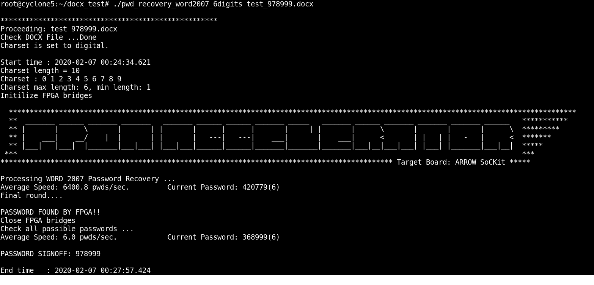

# MS Word 2007 Password Recovery Acceleration On Intel Cyclone V SoC FPGA
This design accelerates password recovery process using Intel Cyclone V SoC FPGA. The ARM processor extracts docx info and completes all initializtions. When the recovery process starts, the host sends generated password sets to FPGA via H2F bridge and handshakes status with FPGA via LW bridge. The FPGA implements the full verification process of Word 2007, a high computing intensive flow composed of SHA1 and AES-128. In order to achieve the max performance the pipelined SHA1 runs at >2x frequency over system clock 50MHz and two large buffers are designed to pipe-in and pipe-out data. When FPGA finds out the possible password, the host will verify again to confirm the result. The overall performance is 6,400 passwords/sec, able to complete 6 digit password searching in less than 4 minutes.

	ARM Cortex-A9 @800MHz    :    12 pwds/sec/core
	Intel i7-7700HQ @2.8GHz  :   108 pwds/sec/core
	Intel Cyclone V SoC FPGA : 6,400 pwds/sec/device

 
 

Algorithm
------
[Microsoft Office password protection Wiki](https://en.wikipedia.org/wiki/Microsoft_Office_password_protection)
 
 

Platform
------
[ARROW SoCKit](https://www.arrow.com/en/products/sockit/arrow-development-tools)
• Cyclone V SoC 5CSXFC6D6F31C8NES ver.B
• Dual-core ARM Cortex-A9 (HPS)
• 110K Programmable Logic Elements
• 5,140 Kbits embedded memory
 
 

HowTo
------
1. Copy soc_system.rbf to the FAT32 partition of the SD card for SoCKit
2. Copy pwd_recovery_word2007_6digits and test_978999.docx to the home/root of the SD card
3. Boot SoCKit and login
4. Execute "./pwd_recovery_word2007_6digits test_978999.docx"
 

Screenshot
------

